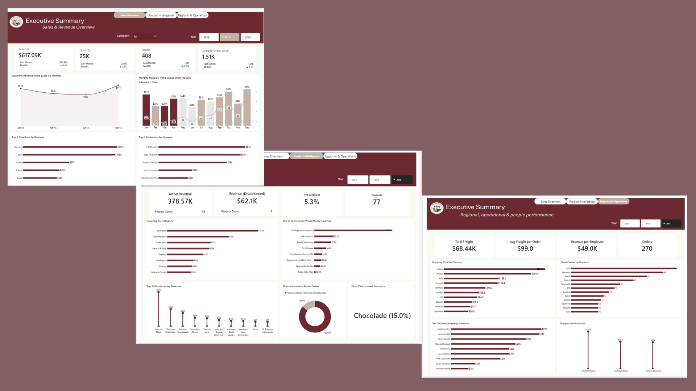

# Northwind-Global-Sales-Operations-and-Product-Performance-BI-Analysis

## About this Project:
I built this project to deliver an interactive business intelligence solution designed to provide executives with visibility into global sales performance, product efficiency, and operational effectiveness. By analyzing transactional data from Northwind Traders, the dashboard uncovers key revenue drivers, highlights inefficiencies in shipping costs, and evaluates the impact of discount strategies on profitability.
## Business Problem:
 Northwind Traders lacks a centralized and insight-driven reporting system, making it difficult for executives to effectively monitor sales performance, optimize operations, and evaluate the impact of key business strategies.
## Solution Approach
I addressed these challenges by doing the step-by-step process:
* Data Extraction & Preparation: Loaded the dataset into Power Query, reviewed the data dictionary, and cleaned and standardized the data to ensure accuracy and consistency.
 * Data Modeling: Designed a star schema with a central fact table and supporting dimension tables to enable efficient and scalable analysis.
*  KPI Development: Defined key business metrics such as revenue, order volume, revenue per employee, and freight cost ratio to align analysis with business objectives.
* Dashboard Design & Storytelling: Built an interactive three-page dashboard to deliver clear, actionable insights across sales, product, and operational performance.
## Data Preparation
I began by assessing data quality across all tables, confirming there were no missing values or duplicates. I identified some missing shipping dates and retained them, as they may represent in-transit or canceled orders, which are relevant for operational analysis. I then standardized column names for consistency, corrected data types, and ensured all fields were properly structured to support accurate analysis.
## Data Modeling
I structured the dataset into a star schema by combining the orders and order details tables to create a central sales fact table containing transactional metrics. The remaining table customers, products, categories, and shippers were used as dimension tables to provide analytical context. I enriched the model by linking product data to include category-level insights and established one-to-many relationships between dimensions and the fact table. Additionally, I created a date table to enable time-based analysis and trend evaluation.
## DAX Measures:
### Core Sales Metrics
- Total Revenue: 
 SUMX('Sales', 'Sales'[unitprice] * 'Sales'[Quantity] * (1 - 'Sales'[Discount]))
- Total Orders:
 DISTINCTCOUNT('Sales'[orderid])
- Total Quantity:
 SUM('Sales'[Quantity])
### Time Intelligence:
- Revenue MoM%:
 VAR prevmonth = CALCULATE([Revenue], DATEADD('Date'[Date], -1, MONTH))
 RETURN DIVIDE([Revenue] - prevmonth, prevmonth)
### Product Metrics:
- Active Revenue:
 CALCULATE([Revenue], 'Products'[Discontinued] = 0)
- Discontinued Revenue:
 CALCULATE([Revenue], 'Products'[Discontinued] = 1)
- Avg Discount:
 AVERAGE('Sales'[Discount])
- Product Count:
 DISTINCTCOUNT('Products'[productid])
### Operational Metrics:
- Total Freight:
 SUM('Orders'[Freight])
- Avg Freight per Order:
 DIVIDE([Total Freight], [Total Orders])
- Revenue per Employee:
 DIVIDE([Revenue], DISTINCTCOUNT('Employees'[employeeid]))
## Dashboard Walkthrough & Business Answered:
## Sales & Revenue Overview
### Overall business performance
- KPI cards highlight total revenue, orders, quantity, and average order value
- Revenue trend shows performance fluctuations and recovery pattern
- Monthly chart compares revenue vs order volume
- Top countries identify strongest markets
- Top customers highlight key revenue contributors.

## Product & Category Intelligence
### Product performance and discount impact
- Active vs discontinued revenue shows contribution gap
- Category analysis highlights top revenue drivers
- Top products identify key revenue-generating items
- Discount metrics show average discount applied
- Discontinued product analysis reveals lost revenue opportunities

## Regional, Operational & People Performance
### Efficiency and productivity
- Freight metrics highlight total and average shipping cost
- Shipping cost by country identifies expensive regions (e.g., Ireland)
- Orders by country shows demand distribution
- Revenue per employee measures productivity
- Salesperson ranking highlights top performers
- Shipper performance compares cost efficiency

## Key Insights
+ Revenue shows a recovery trend after a mid-period dip
+ A small number of customers and products drive a large share of revenue
+ Beverages category is the strongest revenue contributor
+ Discontinued products still contribute noticeable revenue, indicating missed opportunities
+ Some regions generate high revenue but also incur high shipping costs
+ Employee performance is uneven, with a few top performers leading sales
+ Higher discounts increase sales but may reduce revenue quality

## Recommendations
+ Optimize discount strategy to protect margins
+ Focus on high-performing product categories for growth
+ Reassess discontinued products with strong historical sales
+ Improve shipping efficiency in high-cost regions
+ Implement performance-based incentives for sales employees
+ Evaluate shipper cost-effectiveness for better logistics decisions.

## Limitations
+ No cost data → profit analysis not included
+ Missing shipping dates limit delivery performance analysis
+ Dataset size limits real-world scalability assumptions.

## Tools Used:
+ Power BI for modelling, DAX, and dashboard design.
+ Power Query for data cleaning and transformation.
+ Excel/CSV for staging and initial profiling.

## Dashboard Link:
https://app.powerbi.com/view?r=eyJrIjoiNTk3MTRhYmMtYmVhNi00MDc2LTkzYzMtZTc4OGE1MWRiZDVhIiwidCI6ImYxOGJkN2FhLTg1YzQtNDJjOS1iNjdjLTUxMWZjZGY5ZjYyNSJ9
